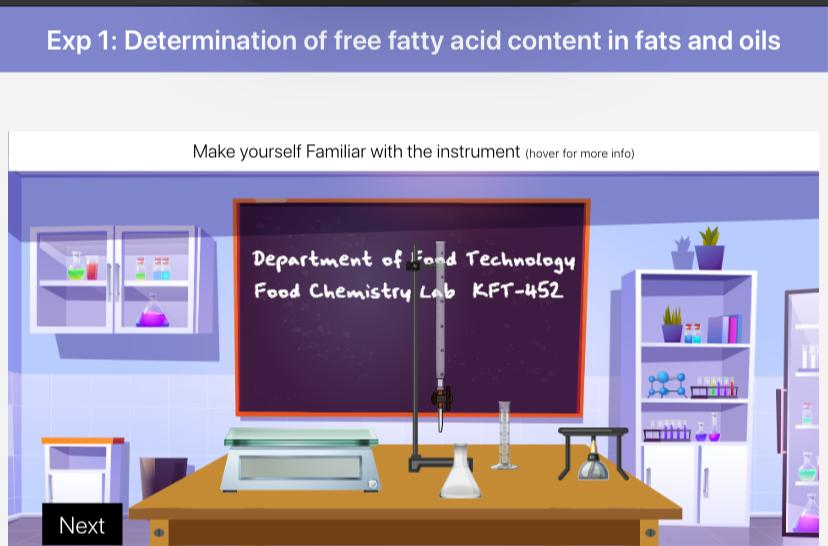
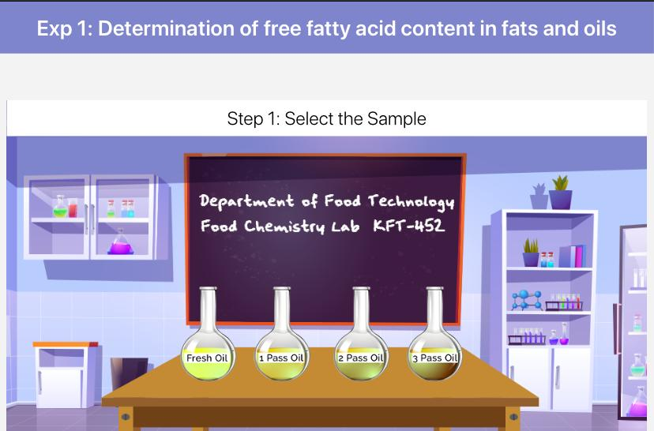
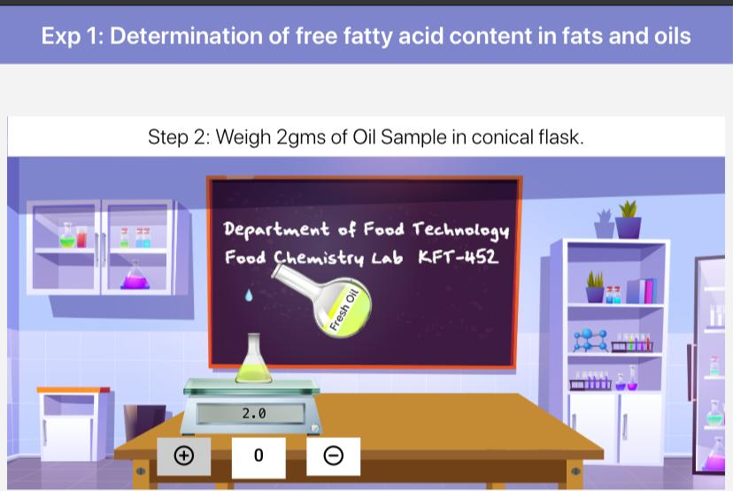
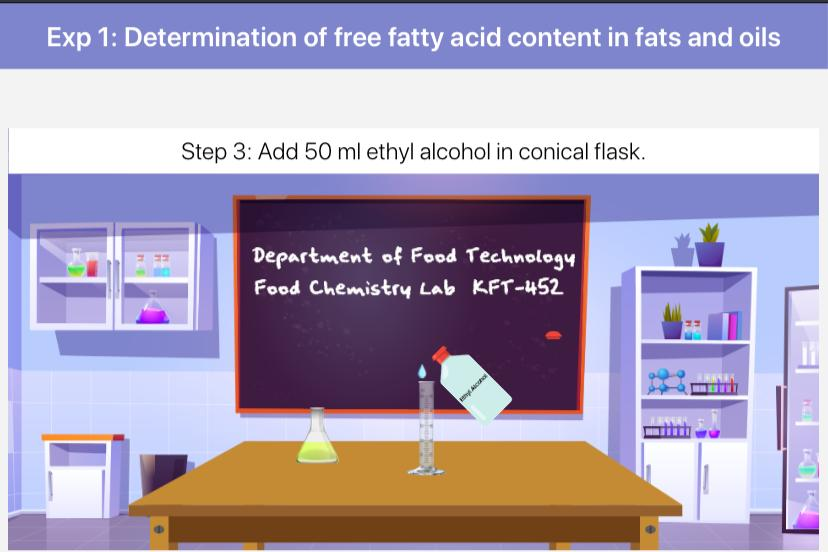
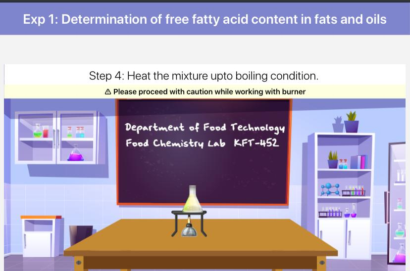
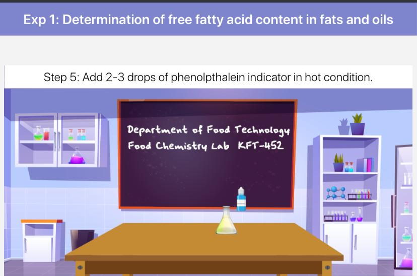
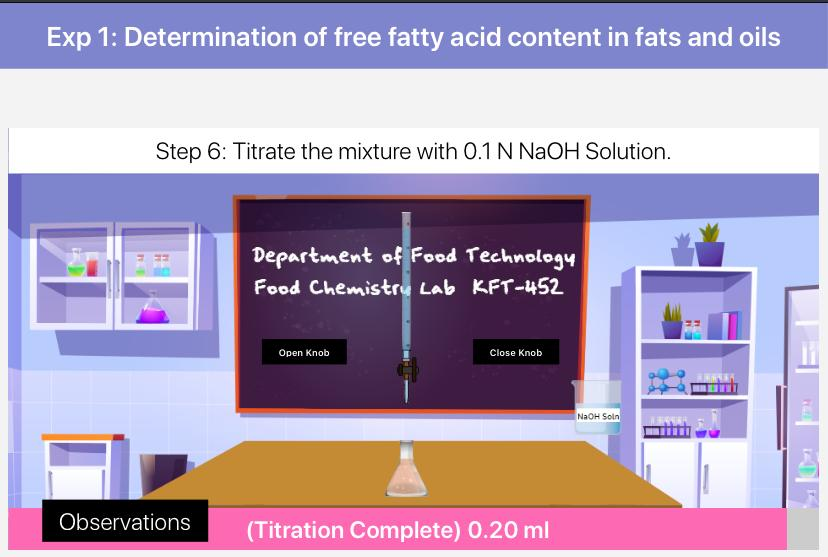
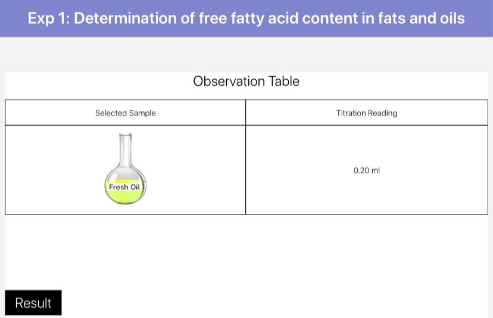
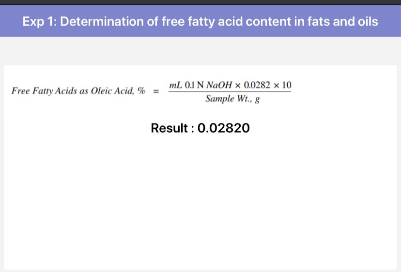

## Storyboard (Round 2)

Experiment 1: Determination of free fatty acid content in fats and oils

### 1. Story Outline:

This experiment involves first of all selection of fats/oils sample and then preparing the sample for further analysis. To complete the experiment, titration of the sample is desirable which starts with titrating the sample with NaOH and continue till faint pink color appears. After that, volume of titrant used is recorded. Then on the basis of obtained data free fatty acid content is determined and estimation of sample quality is done.

The main objective of this experiment is to determine free fatty acid content in fats and oils. During the operation student will be able to relate pre-learnt concepts and understand new concepts. Further, apply the concepts to analyze the sample and determine the free fatty acid in fats/oils. Further based on the results, user will be able to estimate the sample quality.

### 2. Story:

First users will get themselves familiar with the experimental set-up and then select the desired sample of fats/oils to analyze free fatty acid content in it. Then user will take conical flask, tare its weight and weigh 2.0 gm of selected sample. After this, user will add 50 ml ethyl alcohol into sample flask. Now user will heat this sample mixture to boiling point by keeping it on hot plate. As the sample starts boiling, add 2-3 drops of phenolphthalein indicator in it. User will fill the burette with 0.1 N NaOH solution and start titration of sample by opening knob of burette. User will observe the color change and once it is faint pink color, user will stop the process by closing knob of burette. User will record the volume of NaOH used and determine the %FFA content using formula. After getting result, user can estimate the quality of sample by on the basis of free fatty acid content.

#### 2.1 Set the Visual Stage Description:

In the simulator user will be able to see the virtual prototype of experimental set up resembling the actual experimental set up that is present in real time labs. Set up consists of 4 different fat/oil samples which are fresh, 1 pass, 2 pass and 3 pass. An analytical balance is there to take the weight of sample and a measuring cylinder to measure the volume of chemical reagents, time to time during experiment. The burette having 0.1N sodium hydroxide solution will be used for the titration process. Phenolphthalein will be used as indicator to reach end point of titration. 

#### 2.2 Set User Objectives & Goals:

1. The prime objective of this experiment is to determine free fatty acid content in fats and oils
2. User will be able to relate the concept of sample selection
3. User will be able to explain the concept of sample preparation
4. User will be able to apply the knowledge of acid-base titration
5. User will be able to analyze the sample by titrating it
6. User will be able to determine %FFA content and estimate quality of the sample

#### 2.3 Set the Pathway Activities:

1. As per experimental setup, there are 4 different fat/oil samples available which will be recognized by user as each have naming in the set up.
2. User will select anyone sample and weigh it by using analytical balance.
3. Then click to add 50 ml ethyl alcohol to the sample conical flask, place it on hot plate for boiling and add 2-3 drops phenolphthalein indicator.
4. User will drag the hot sample conical flask under burette having 0.1 N NaOH solution and press ‘Open knob’ Tab of the burette.
5. Simulator will display the titration process and change in color of sample as per steps.
6. Once titration is completed, user will press ‘Observations’ tab.
7. User will then press on the ‘Formula' tab, enter the manually calculated value in given space, press on the 'Check' tab & then 'Result' Tab.
8. Simulator will provide the result after calculation based on observed data.
9. Based on result of %FFA value, user will be able to estimate quality of fat/oil sample.

##### 2.4 Set Challenges and Questions/Complexity/Variations in Questions:

Difficulty level: Remember (LO1)

1. Free Fatty acid content of oil is expressed in terms of 
    a) % ascorbic acid  
    <b>b) % oleic acid</b> 
    c) mg fatty acid 
    d) % fatty acid

2. Titrant used in determining % FFA 
   <b>a) NaOH</b> 
    b) H2SO4 
    c) HCl  
    d) Chloroform

Difficulty level: Understand (LO2)

3. At room temperature, unsaturated fatty acids will have 
    a) Solid consistency 
    <b>b) Liquid consistency</b> 
    c) Waxy consistency 
    d) Cannot be predicted

Difficulty level: Apply (LO3)

4. Which of the following can be directly calculated from free fatty acids content of fat/ oil? 
    <b>a) Acid number</b> 
    b) Iodine number 
    c) Saponification number 
    d) Richert-Meissl number
   
##### 2.5 Allow pitfalls:

During the titration step, user will be allowed to over titrate the sample by continuing addition of titrant after color change (that indicates end point of titration). The pitfall will show ‘Over-titrated’ and user is not able to move to next step and user has to go back to the step 1 of sample preparation and perform again.

##### 2.6 Conclusion:

User will take approximate 5-7 minutes for understanding the procedure. Then for generating data by the help of simulator will take 8-10 minutes. After onwards for calculating result will take 2-3 minutes. Hence, total time taken for doing experiment will be approximately 15-20 minutes.

##### 2.7 Equations/formulas: 

The equation used in determination of free fatty acid content in fats/oils is:

Where,  
V= volume of NaOH used (ml)  
N= Normality of NaOH  
W= weight of sample (gm)  

### 3. Flowchart:

 

### 4. Mindmap:

 

### 5. Storyboard :

